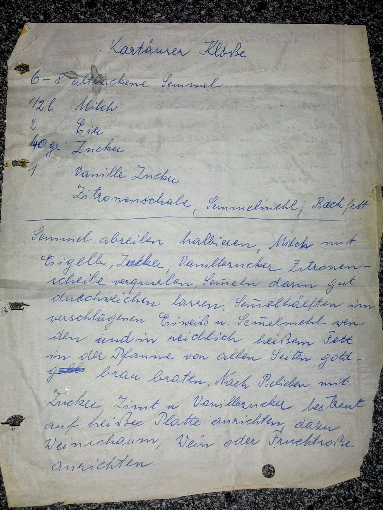
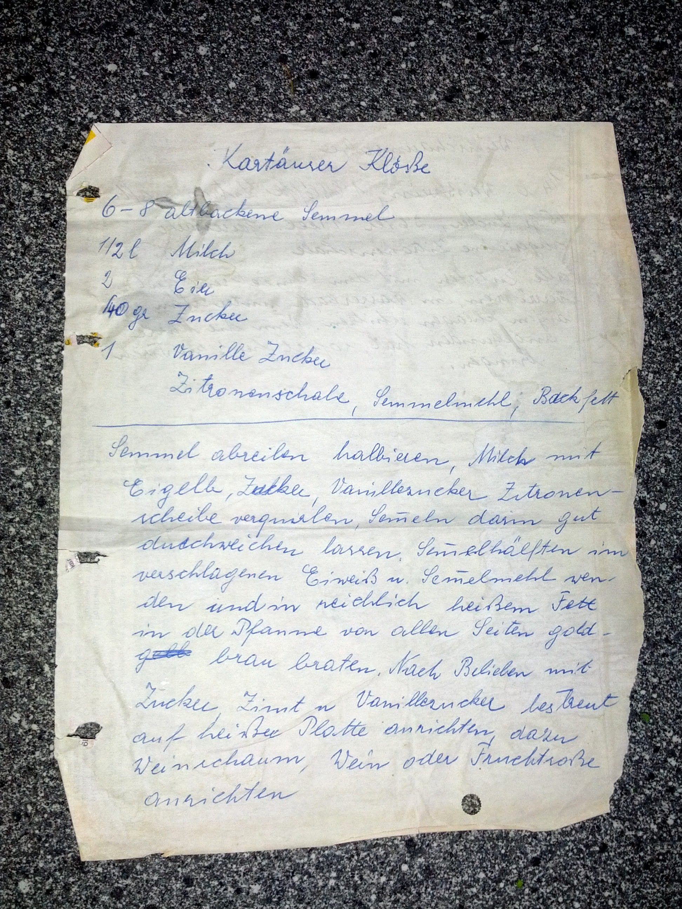
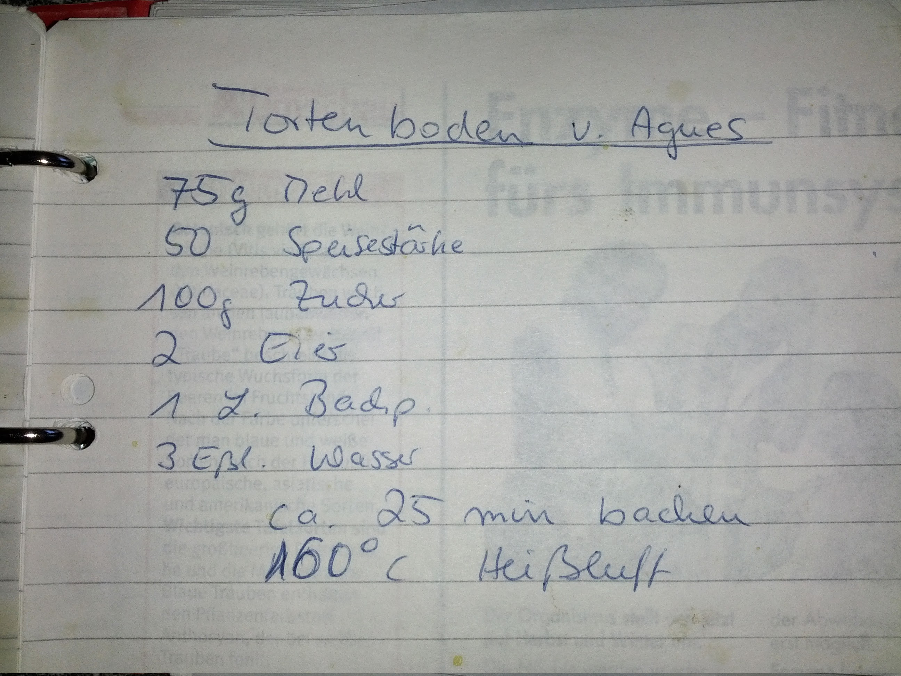
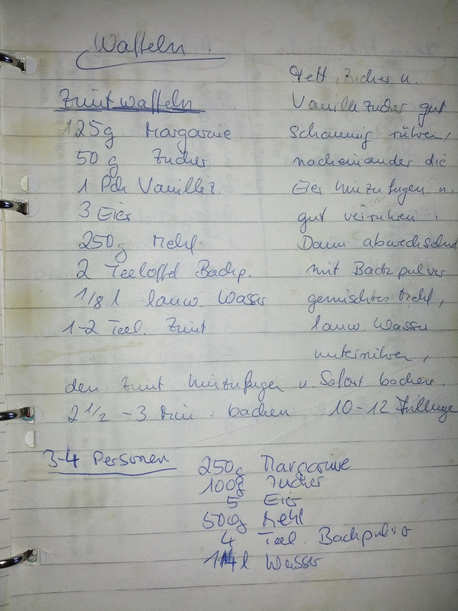
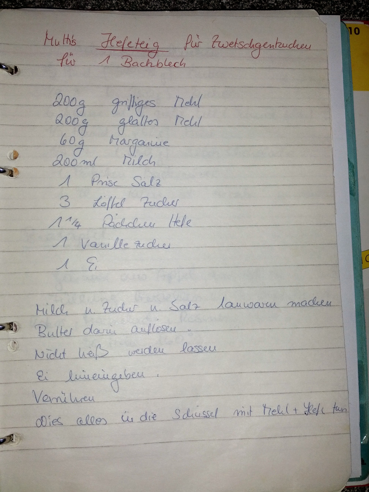
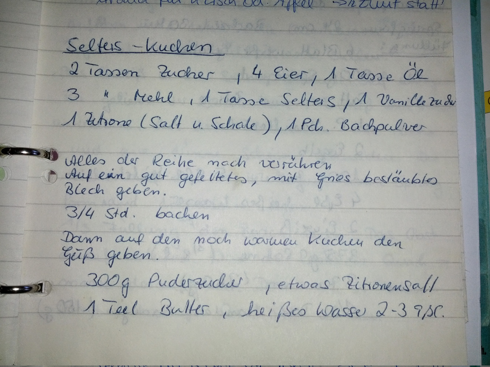
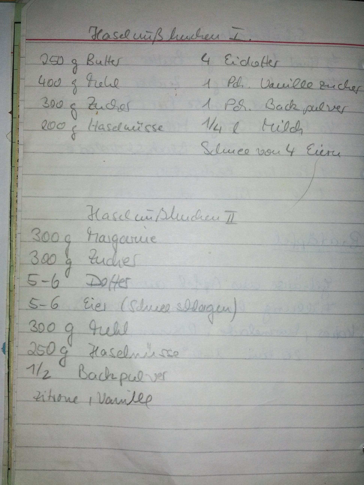
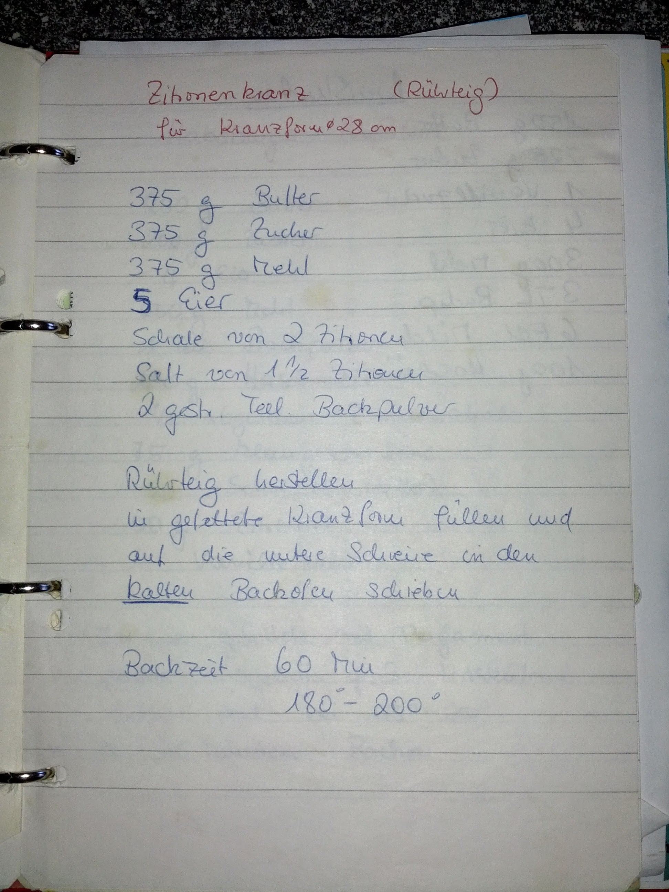
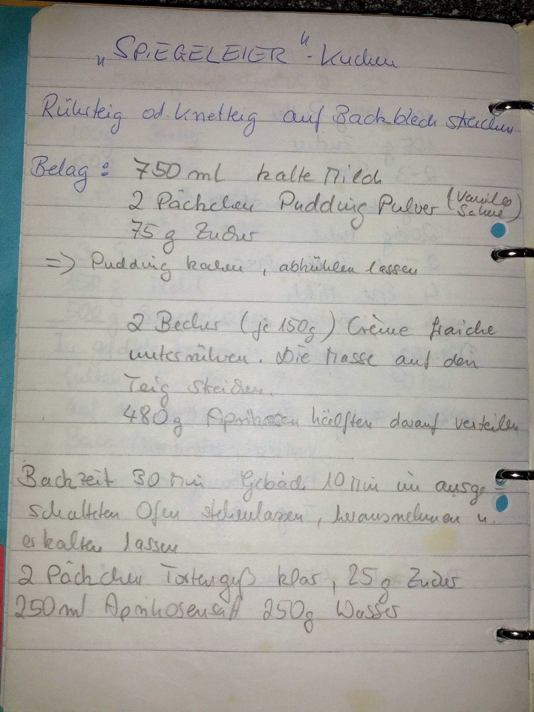
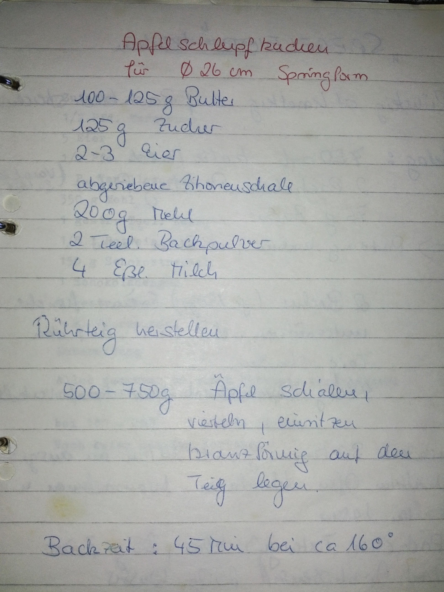

# Rezepte

## Kartäuser Klöße (Tante Agnes)

- 6-8 altbackene Semmel
- 0,5l Milch
- 2 Eier
- 40g Zucker
- 1 Vanillezucker
- Zitronenschale, Semmelmehl, Backfett

Semmel abreiben und halbieren. Milch mit Eigelb, Zucker, Vanillezucker und Zitronenscheibe verquirlen, Semmeln darin gut durchweichen lassen. Semmelhälften im verschlagenen Eiweiß und Semmelmehl wenden und in reichlich heißem Fett in der Pfanne von allen Seiten goldbraun braten. Nach belieben mit Zucker, Zimt und Vanillezucker bestreut auf heißer Platte anrichten.

 

## Tortenboden (Tante Agnes)

- 75g Mehl
- 50g Speisestärke
- 100g Zucker
- 2 Eier
- 1 Löffel Backpulver
- 3 Esslöffel Wasser

**Backzeit:** ca. 25 min bei 160 Grad Heißluft.

## Zimt-Waffeln

- 125g Margarine
- 50g Zucker
- 1 Packung Vanillezucker
- 3 Eier
- 250g Mehl
- 2 Teelöffel Backpulver
- 1/8l lauwarmes Wasser
- 1-2 Teelöffel Zimt

Fett, Zucker und Vanillezucker gut schaumig rühren, nacheinander die Eier hinzufügen und gut verrühren. Dann abwechselnd mit Backpulver gemischtes Mehl, lauwarmes Wasser unterrühren, den Zimt hinzufügen und sofort backen.
2,5 bis 3 min. backen.

## Hefeteig für Zwetschgenkuchen

Für ein Backblech:

- 200g griffiges Mehl
- 200g glattes Mehl
- 60g Margarine
- 200ml Milch
- 1 Prise Salz
- 3 Löffel Zucker
- 1,25 Päckchen Hefe
- 1 Vanillezucker
- 1 Ei

Milch und Zucker und Salz lauwarm machen. Butter darin auflösen, nicht heiß werden lassen. Ei hineingeben. Verrühren. Dies alles in die Schüssel mit Mehl + Hefe tun.

## Selters-Kuchen

- 2 Tassen Zucker
- 4 Eier
- 1 Tasse Öl
- 3 Tassen Mehl
- 1 Tasse Selters
- 1 Vanillezucker
- 1 Zitrone (Saft und Schale)
- 1 Backpulver

Alles der Reihe nach verrühren. Auf ein gut gefettetes, mit Grieß bestäubtes Blech geben. 3/4 Stunden Backen.

Dann auf dem noch warmen Kuchen den Guss geben:
- 300g Puderzucker
- etwas Zitronensaft
- 1 Teelöffel Butter
- heißes Wasser 2-3 Esslöffel

## Haselnuss-Kuchen

### Variante 1

- 250g Butter
- 400g Mehl
- 300g Zucker
- 200g Haselnüsse
- 4 Eidotter
- 1 Vanillezucker
- 1 Backpulver
- 1/4l Milch
- Schnee von 4 Eiern

### Variante 2

- 300g Margarine
- 300g Zucker
- 5-6 Dotter
- 5-6 Eier (Schnee schlagen)
- 300g Mehl
- 250g Haselnüsse
- 1/2 Backpulver
- Zitrone
- Vanille

## Zitronenkranz

Rührteig für Kranzform (28cm):

- 375g Butter
- 375g Zucker
- 375g Mehl
- 5 Eier
- Schale von 2 Zitronen
- Saft von 1,5 Zitronen
2 gestrichene Teelöffel Backpulver

Rührteig herstellen, in gefettete Kranzform füllen und auf die untere Schiene in den **kalten** Backofen schieben.
Backzeit 60 min bei 180-200 Grad.

## "Spiegeleier"-Kuchen

Rührteig oder Knetteig auf Backblech streichen.

Belag:

- 750ml kalte Milch
- 2 Päckchen Pudding-Pulver (Vanille Sahne)
- 75g Zucker

Pudding kochen, abkühlen lassen.
2 Becher (je 150g) Crème fraiche unterrühren. Die Masse auf den Teig streichen.
480g halbe Aprikosen darauf verteilen.

Backzeit 30 min. Gebäck 10 min im ausgeschalteten Ofen stehenlassen, herausnehmen und erkaltem lassen.

2 Pächen Tortenguss klar, 25g Zucker, 250ml Aprokosensaft, 250g Wasser

## Apfelschlupf-Kuchen

Für 26cm Springform:

- 100-125g Butter
- 125g Zucker
- 2-3 Eier
- abgeriebene Zitronenschale
- 200g Mehl
- 2 Teelöffel Backpulver
- 4 Esslöffel Milch

Rührteig herstellen.

500-750g Äpfel schälen, vierteln, entkernen und kranzförmig auf den Teig legen.

Backzeit: 25 min bei ca. 160 Grad

