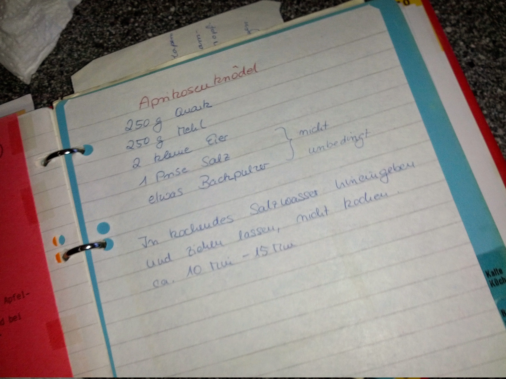

## Aprikosenknödel

- 250g Quark
- 250g Mehl
- 2 kleine Eier
- 1 Prise Salz (*nicht unbedingt*)
- etwas Backpulver (*nicht unbedingt*)

In kochendes Salzwasser hineingeben und 10 bis 15 min ziehen lassen, nicht kochen.

